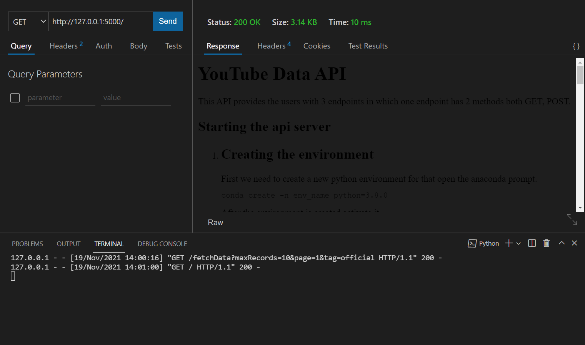
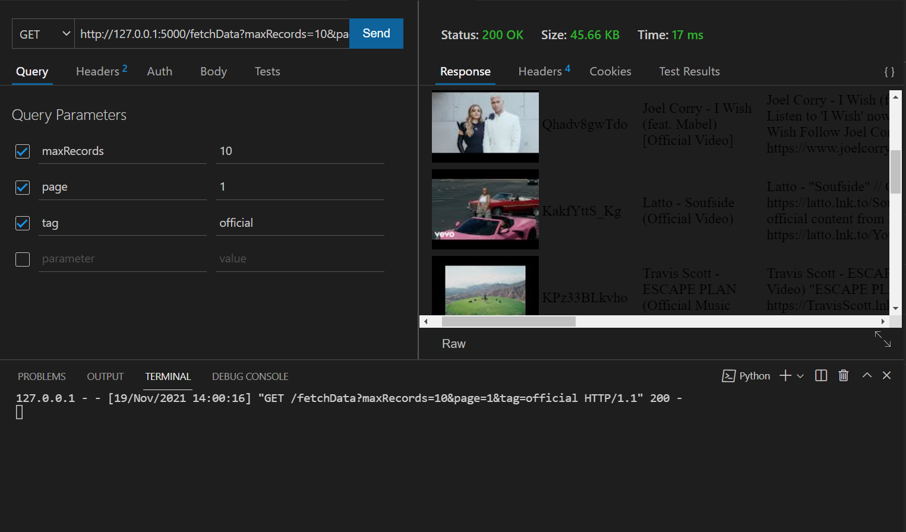
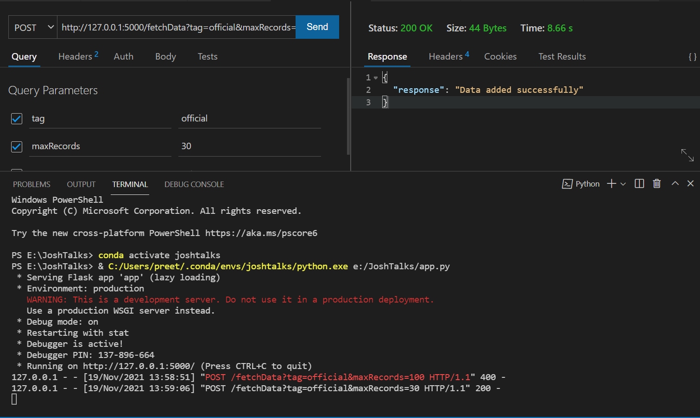

# YouTube Data API
This API provides the users with 3 endpoints in which one endpoint has 2 methods both GET, POST.

## Starting the api server
<ol>
<li>
<h2>Creating the environment</h2>
First we need to create a new python environment for that open the anaconda prompt.

```sh
conda create -n env_name python=3.8.0
```
After the environment is created activate it.
```sh
conda activate env_name
```
</li>
<li>
<h2>Setting up the environment</h2>
After fetching the complete module of this API import all the necessary python packages specified in the requiremnents.txt file.

```sh
pip install -r requirements.txt
```
</li>
<li>
<h2>Starting the API server</h2>
Go to the root directory of the project folder and open the anaconda prompt in the same directory and activate your created environment.

```sh
conda activate env_name
```

Now start the server.

```sh
python app.py
```
</li>
</ol>

<p>
<h2>
Testing the API
</h2>
You can use any API tester or even any browser and use this API.

I have tested the same using Thunder Client and the output are.

### Index Endpoint

### GET fetchData endpoint

### POST fetchData endpoint

</p>

## Endpoint 1 -> "/"
This endpoint provides the descrpition of the API.

## Endpoint 2 -> "/fetchData"
This endpoint has 2 methods GET and POST
<ol>
<li>
<h2>POST</h2>
<p>
    Using the post method we can save the data into the database using specific search queries.
<ol>
<h3>    
    Queries
</h3>
<li>
<h4>Tag</h4>
The tag query parameter will query the data having a specific tag in the vidoes from the YouTube Database and fetch the records and save it to the database
</li>
<li>
<h4>MaxRecords</h4>
The maxRecords query parameter will set the number of maximum records to be fetched from the database
</li>
</ol>
</li>
<li>
<h2>GET</h2>
<p>
    Using the get method we can view the data saved in the local databse in a paginated manner.
<ol>
<h3>    
    Queries
</h3>
<li>
<h4>Tag</h4>
The tag query parameter will query the data having a specific tag in the vidoes from the local Database and display the data into a tabular manner
</li>
<li>
<h4>MaxRecords</h4>
The maxRecords query parameter will set the number of maximum records to be fetched from the database per page.
</li>
<li>
<h4>Page</h4>
The page query parameter will set the page index to be displayed.
</li>
</ol>
</li>
</ol>
</p> 
</li>
</ol>

## Endpoint 3 -> "/searchData"
This endpoint has GET method.
The server fetches the data from the local database provided the query filters and taking the union of all the query filters.
<ol>
<li>
<h2>GET</h2>
<p>
    Using the get method we can view the data saved in the local databse.
<ol>
<h3>    
    Queries
</h3>
<li>
<h4>Title</h4>
The title query parameter will query the data having a specific videotitle in the vidoes from the local Database and display the data into a tabular manner.
</li>
<li>
<h4>Description</h4>
The description query parameter will query the data having a specific description in the vidoes from the local Database and display the data into a tabular manner.
</li>

</ol>
</li>
</ol>
</p> 
</li>
</ol>
